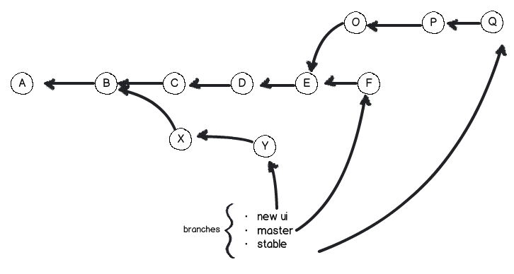
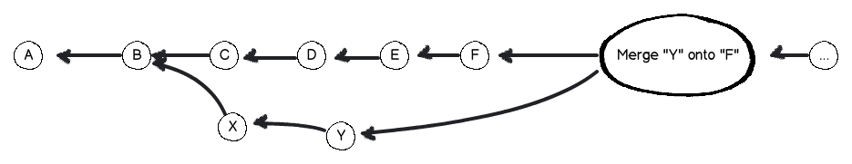

!SLIDE
# Git Inside #
## What the bloody bastard is about ##

!SLIDE commandline
# The Goal #

Feeling your way around this lot:

    $ git init; find .git
    .git
    .git/branches
    .git/refs
    .git/refs/heads
    .git/refs/tags
    .git/hooks
    .git/hooks/post-commit.sample
        <snip>
    .git/hooks/pre-applypatch.sample
    .git/HEAD
    .git/info
    .git/info/exclude
    .git/description
    .git/objects
    .git/objects/info
    .git/objects/pack
    .git/config

!SLIDE subsection
# Why Bother? #

!SLIDE
# Curiosity #

!SLIDE
# Understanding the man pages

!SLIDE
# It's actually useful #
## A quick edit of `.git/config` ##
### vs. ###
## "What was the syntax for adding a new remote repo again?" ##

!SLIDE
## fetch vs. pull ##

!SLIDE
## merge vs. rebase ##

!SLIDE
# Solving tricky situations

!SLIDE subsection
# What is git? #

!SLIDE
# Duh #

!SLIDE
# Distributed #
# Acyclic Directional Graph #

## on top of a filesystem-based ##
# NoSQL Immutable Key/Value #
## database ##

!SLIDE
# Duh indeed #

!SLIDE
# Rewind! #

!SLIDE subsection
# What is git for?

!SLIDE
# Filesystem Snapshots #

!SLIDE
# History #

!SLIDE
## The entire history of all the files in the repo

!SLIDE
## Need to store them somehow

!SLIDE subsection
# Git Object Database #

!SLIDE
# Key/Value store

!SLIDE
# Value can be anything

!SLIDE
# Key is a SHA-1 digest

!SLIDE
# Immutable objects
## Changing a value means storing it separately
## under a different key.

!SLIDE
# Distributed by design

!SLIDE
## The same object
## has the same key everywhere
## all the time.

!SLIDE bullets
# Git's trinity

* Blob
* Tree
* Commit

!SLIDE subsection
# What's a Blob?

!SLIDE
# a regular file

!SLIDE
# no metadata

!SLIDE
# stored as is

!SLIDE commandline
# Blob exposed

    $ git cat-file blob 858e207b3ea2e44f37eb6b85653a780ec777ad67

    package main

    import "fmt"

    func main() {
            fmt.Println("Hello, World")
    }

!SLIDE subsection
# What's a Tree?

!SLIDE
# a directory

!SLIDE
# contains trees and blobs

!SLIDE
# keeps metadata

!SLIDE
## filenames
## file mode bits
## path and directory structure

!SLIDE commandline
# Tree exposed

    $ git ls-tree d6eaef3888c13602a89a5c59c88007819af10f98

    100644 blob 71694f9d8b8a3874cb9afea9afab	hello.go
    040000 tree 27a2ef8d582b6fafa5163251898e	lib
    100644 blob ae368b0135b0d26cf6c976909b58	COPYING
    100644 blob ee3e239aca529f82eed2fbae8b08	db.go

!SLIDE subsection
# Renaming a file

!SLIDE
# **doesn't**
# change the blob

!SLIDE
# **does**
# create a new tree

!SLIDE subsection
# What's a Commit?

!SLIDE
# repository snapshot

!SLIDE
# piece of history

!SLIDE
# git's cornerstone

!SLIDE
## has one Tree

!SLIDE
## one or more parents

!SLIDE bullets
# metadata

* author's name & email
* commit message
* timestamp
* ...

!SLIDE commandline
# Commit exposed

    $ git cat-file commit fa29...efae368b0135b0d26cf6c976909b58

    tree d6eaef3888c13602a89a5c59c88007819af10f98
    parent 4593afa00bb4cb52eb289f72788a1879231947d6
    author Tomas Sedovic <tomas@sedovic.cz> 1324171835 +0100
    committer Tomas Sedovic <tomas@sedovic.cz> 1324171835 +0100

    Add "hello world" in Go

!SLIDE subsection
# Keeping track of history

!SLIDE
## Commit is a snapshot in time

!SLIDE
## Its parent is the previous snapshot

!SLIDE
## *Its* parent is the snapshot before that

!SLIDE
# Commits all the way down!

!SLIDE
## "Show me a commit,
## and I'll show you its history."

!SLIDE center
# Commits

!SLIDE subsection
# Branches, too!

!SLIDE center

!SLIDE subsection
# Nota bene

!SLIDE
## You can see commit's past but not its future

!SLIDE
## Branch must keep track of the latest commit

!SLIDE
## It's possible to have "orphans"

!SLIDE
## No harm but they waste space

!SLIDE
# Garbage collection

!SLIDE subsection
# Epiphany

!SLIDE
# Everything Is A Commit

!SLIDE subsection
# Branches are commits

!SLIDE center

!SLIDE
## Branch is just a named pointer to a commit

!SLIDE
## Always points to the latest change

!SLIDE
## Must be updated when a new commit is added

!SLIDE commandline
# Just a named commit

    $ cat .git/refs/heads/master
    d846a66e6c8b6b301954bc4a9821698908805192

    $ cat .git/refs/heads/new-ui
    466f179482db268ee8ddea0610560041721855bb

    $ cat .git/refs/heads/stable
    c83126effb209dbf492f01589005ecd77e4deaa8

!SLIDE subsection
# What does it mean?

!SLIDE
## Whenever you use a branch,
## you can use a commit hash instead,
## and vice versa.

!SLIDE commandline
# checkout

    $ git checkout master

    $ git checkout d846a66e6c8b6b301954bc4a9821698908805192

!SLIDE commandline
# format-patch

    $ git format-patch -o /tmp/patches master

    $ git format-patch -o /tmp/patches d846c8b6b301954bc4a982169

!SLIDE commandline
# interactive rebase

    $ git rebase -i master

    $ git rebase -i d846a66e6c8b6b301954bc4a9821698908805192

!SLIDE subsection
# Tags are commits

!SLIDE center

!SLIDE
# Tag is a name for a particular commit

!SLIDE commandline
# Stored just like branches

    $ cat .git/refs/tags/beta
    3666273ea7a53885a2bb6403393d9564cfea6424

    $ cat .git/refs/tags/rc1
    5cdd7d048afbb4c44b378e142c990907d460a9d7

    $ cat .git/refs/tags/rc2
    f6dd12d6398e57a84ba993f3f2900ee0636963f3

!SLIDE subsection
# Tags vs. Branches

!SLIDE
# Tags never change

!SLIDE
# Branches move forward

!SLIDE subsection
# Merging branches

!SLIDE
## Branches exist to be merged back in,

!SLIDE
## or die.

!SLIDE
# `git-merge`

!SLIDE
## Joins two branches together

!SLIDE
## Merges a topic branch onto the current one

!SLIDE
## The order is significant

!SLIDE
# These are different

    git checkout master; git merge feature

    git checkout feature; git merge master

!SLIDE
## Merging creates a new commit

!SLIDE
# Merge Commit

!SLIDE
## Has two parents

!SLIDE
## Determines the commit order

!SLIDE
## Resolves conflicts

!SLIDE
# Merging 2 branches

!SLIDE
# Merge Commit

!SLIDE
# Single timeline

!SLIDE subsection
# Rebasing

!SLIDE
## "Merging without the bloody merge commit"

!SLIDE
# Very powerful

!SLIDE
# Different semantics

    $ git checkout feature
    $ git rebase master

!SLIDE
## Moves the rebased branch on top of the base branch

!SLIDE
# Rebase Y onto F

!SLIDE
# Y is on top of F

!SLIDE
## They're still separate branches

!SLIDE
# Fast-forward Merging

!SLIDE
## Merging a rebased branch, means no merge commit.

!SLIDE commandline
# Creates Merge Commit

    $ git checkout master
    $ git merge feature

!SLIDE commandline
# No Merge Commit

    $ git checkout feature
    $ git rebase master

    $ git checkout master
    $ git merge feature

!SLIDE subsection
# Rebase caveats

!SLIDE
# It changes history

!SLIDE
# Push rejects history changes

!SLIDE
# Use rebase only locally

!SLIDE
## Once you've pushed the branch,
## you **really** should use merge.

!SLIDE
# `git push --force`
## works but it's evil

!SLIDE
## Slap in the face to everyone who pulls the changed history.

!SLIDE subsection
# Remote repositories

!SLIDE
# Git is decentralised

!SLIDE
## Synchronise with any number of repos

!SLIDE
## No topology constraints

!SLIDE
# `git-fetch`

!SLIDE
## Updates all your commits from the remote repository

!SLIDE
## Doesn't change any references

!SLIDE
## Completely safe

!SLIDE
# `git-pull`

!SLIDE
## `git-fetch` followed by `git-merge`

!SLIDE
## First, gets the remote commits

!SLIDE
## Then, updates your current branch

!SLIDE
## Must be run on a clean repo

!SLIDE
## May cause conflicts

!SLIDE
## May create merge commits

!SLIDE
## **Don't**
## pull on a branch with local changes

!SLIDE
# `git-push`

!SLIDE
## Sends the local commits to the remote repo

!SLIDE
## Reverse of pull

!SLIDE
## Updates the commits **and** references

!SLIDE
## May be rejected

!SLIDE subsection
# References

!SLIDE
## Git can be operated using commit hashes only

!SLIDE
## The Web can be operated using IP addresses only, too.

!SLIDE
# Refs are git's DNS

!SLIDE
## Located in `.git/refs/`

!SLIDE commandline
# Branch references

    $ ls .git/refs/heads/

      master
      admin_ui
      review
      bz-3482938

!SLIDE commandline
# Tag references

    $ ls .git/refs/tags/

      v0.7.0_RC1
      v0.7.0_RC2
      v0.7.0_RC4
      v0.7.0_RC3

!SLIDE
# Remotes

!SLIDE
## Reference remote branches

!SLIDE
## `.git/refs/remotes/`

!SLIDE commandline
## Every remote repo has its own subdirectory

    $ ls .git/refs/remotes/

      origin
      github
      private

!SLIDE commandline
## Refs contain **only** commit hashes

    $ cat .git/refs/remotes/github/master

    77014ab62efd1cfcc5c6d9e077c90dae8e7798c9

!SLIDE
# Where's the repo URI?

!SLIDE commandline
# `config`

    $ cat .git/config

    ...
    [remote "origin"]
        fetch = +refs/heads/*:refs/remotes/origin/*
        url = git@github.com:aeolusproject/conductor.git

    [remote "private"]
        url = ssh://myprivaterepo.org/conductor.git
        fetch = +refs/heads/*:refs/remotes/private/*
    ...

!SLIDE commandline
# Local remotes

    $ cat .git/config

    ...
    [remote "origin"]
        url = /var/backup/tsedovic/myrepo.git
        fetch = +refs/heads/*:refs/remotes/origin/*
    ...

!SLIDE
# Name collisions

!SLIDE
# Use the full ref

    git checkout refs/heads/release

vs.

    git checkout refs/tags/release

vs.

    git checkout refs/remotes/origin/release

!SLIDE subsection
# Back to objects

!SLIDE commandline
# Object database

    $ ls .git/objects

    .git/objects/d6/eaef3888c13602a89a5c59c88007819af10f98
    .git/objects/85/8e207b3ea2e44f37eb6b85653a780ec777ad67
    .git/objects/09/ddc1a30c7971694f9d8b8a3874cb9afea9afab
    .git/objects/02/69872c9a2fb852656260cc84d6a1ffc2ef4497
    .git/objects/e7/c3efffa012f7e73d544616dda2766be19145a1
    .git/objects/b2/07a523255627a2ef8d582b6fafa5163251898e
    .git/objects/0c/079e5f2e1b8b1179203dfd994f4dc5489d61f5
    .git/objects/2f/b5341ee744f821104bb32d4b2aacbdff66494c
    .git/objects/fa/2925fc37efae368b0135b0d26cf6c976909b58
    .git/objects/45/93afa00bb4cb52eb289f72788a1879231947d6
    .git/objects/de/19ac038179f28797ec8264e5721ee3528fe1c8
    ...

!SLIDE
## Every object stored under its own hash

!SLIDE
## Blobs, Trees, Commits

!SLIDE
## Not just copies of the files they represent

!SLIDE
## Compressed contents + type and size

!SLIDE
# Inspecting objects

!SLIDE commandline
## `git cat-file type hash`

    $ git cat-file blob 858e207b3ea2e44f37eb6b85653a780ec777ad67

    package main

    import "fmt"

    func main() {
            fmt.Println("Hello, World")
    }

!SLIDE subsection
# That's all

!SLIDE bullets
# Still don't have enough?

* man git
* http://book.git-scm.com/index.html
* http://newartisans.com/2008/04/git-from-the-bottom-up/
